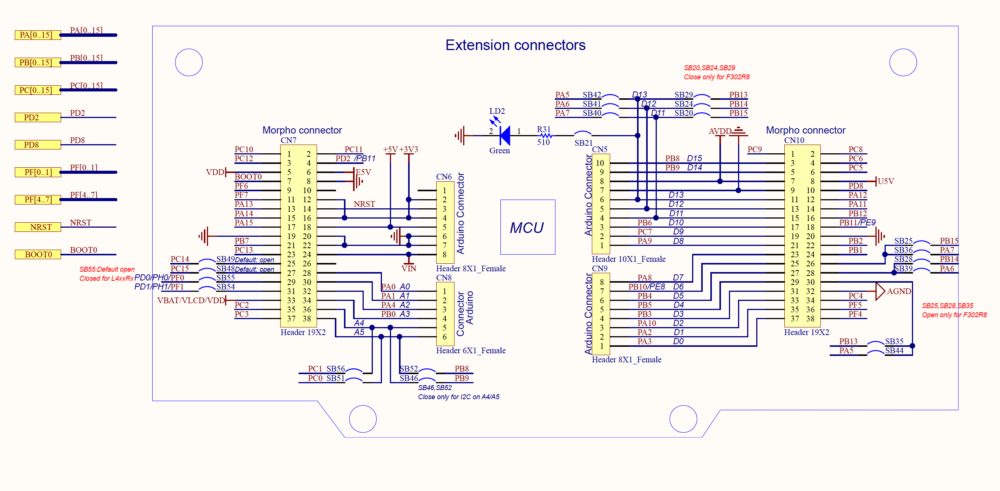

# STM32-SD-SDIO
getting an STM Nucleo-F446RE to write to an SD card via 1-wire and 4-wire  SDIO

for the 1 wire interface, connect:
- DO to PC8
- CMD to PD2
- CLK to PB2
- PWR and GND

for the 4 wire interface, connect: 
- D0 to PC8
- CMD to PD2
- CLK to PB2
- D3 to PC11
- D2 to PB1
- D1 to PB0
- PWR and GND
